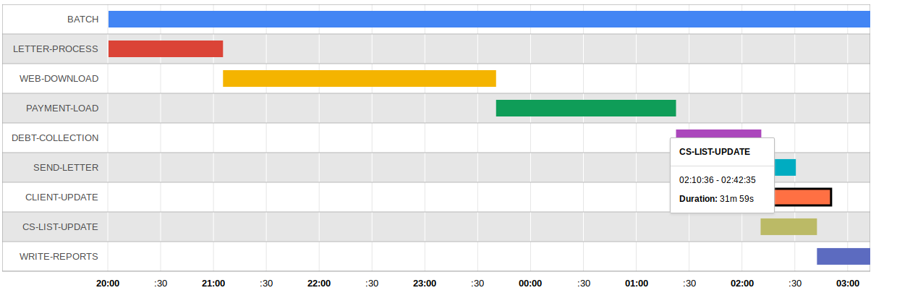
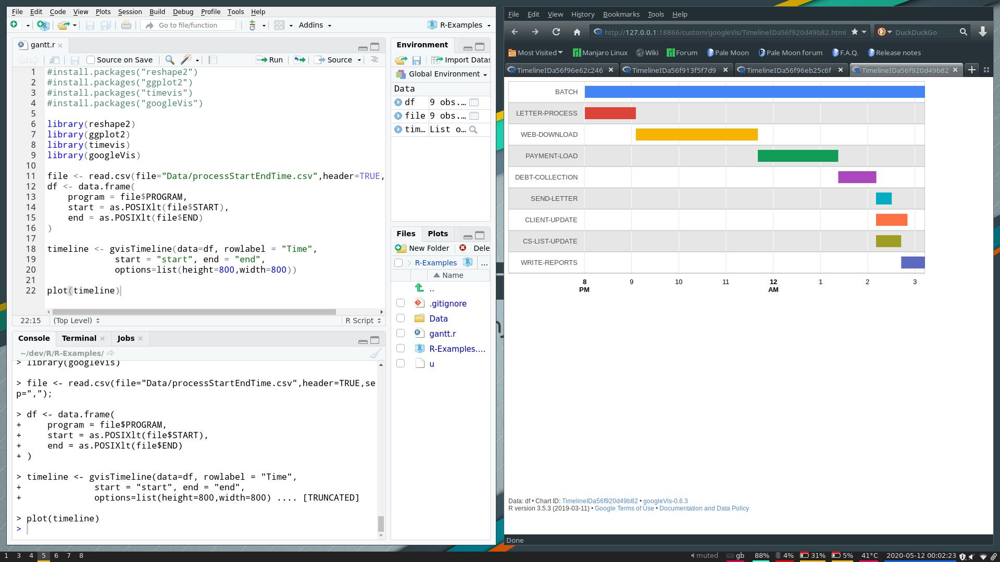

The data from the logs has been extracted and now we are ready to start displaying the data.

we will be using gcharts and R to give a general overview

These charts are useful for giving a overview of the system and can be used by the stakeholders as a reference as the project advances.

| PROGRAM         |          START          |                     END |
| --------------- | :---------------------: | ----------------------: |
| BATCH           | 2020-05-05 20:00:00 UTC | 2020-05-06 02:42:35 UTC |
| LETTER-PROCESS  | 2020-05-05 20:00:00 UTC | 2020-05-05 21:05:25 UTC |
| WEB-DOWNLOAD    | 2020-05-05 21:05:25 UTC | 2020-05-05 23:40:25 UTC |
| PAYMENT-LOAD    | 2020-05-05 23:40:25 UTC | 2020-05-06 01:22:35 UTC |
| ...    | ... | ... |

download .csv [here](https://raw.githubusercontent.com/DarylJtn/R-Examples/master/Data/processStartEndTime.csv)


##PACKAGES
4 packages will be used to produce this report, reshape2 for manipulating the data, GGplot2 for making the charts using the google charts api and timevis for working with the datestamps

###Installing packages

packages can be installed by adding the install commands to the beginning of scripts or by running the install commands in the REPL

```R
install.packages("reshape2")
install.packages("timevis")
install.packages("googleVis")
```

##CODE
We will start our program by importing our libraries

```R
library(reshape2)
library(timevis)
library(googleVis)
```

The data is stored in a csv format. We will transpose the data into a dataframe for to be easier to work with in charts.
POSIXlt will format the start and end timestamp in a date format 

```R
file <- read.csv(file="processStartEndTime.csv,header=TRUE,sep=",");
df <- data.frame(
    program = file$PROGRAM,
    start = as.POSIXlt(file$START),
    end = as.POSIXlt(file$END)

)
```
you can specify the delimiter character used in the file and if the file contains headers using the read.csv function

The gvisTimeline function to produce the timeline chart. We specify the date,label,start field, end filed and size dimensions and use the plot command to produce the chart

```R
timeline <- gvisTimeline(data=df, rowlabel = "Time", 
             start = "start", end = "end",
             options=list(height=800,width=800))

plot(timeline)⏎      
```



